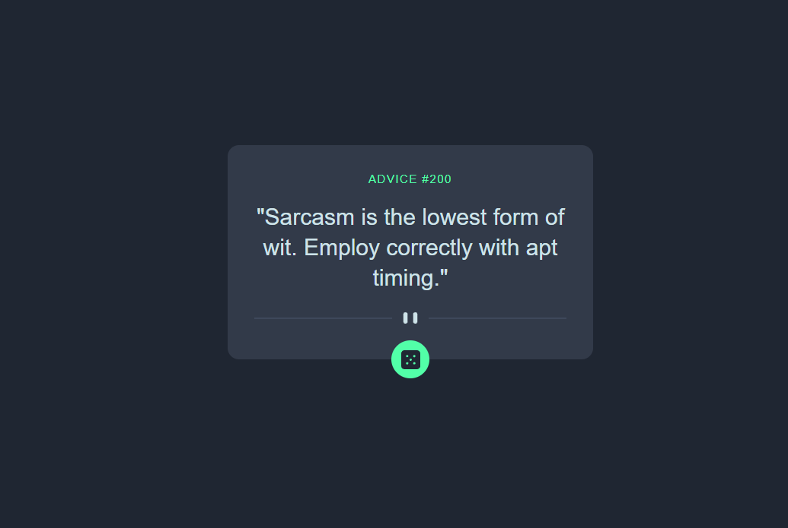

# Frontend Mentor - Advice generator app solution

- Advice generator

## Table of contents

- [Overview](#overview)
  - [The challenge](#the-challenge)
  - [Screenshot](#screenshot)
  - [Built with](#built-with)
  - [What I learned](#what-i-learned)
- [Author](#author)

## Overview

This is a responsive advice generator app built with **Tailwind CSS**. The application fetches random advice from an API and displays it in a clean, modern interface. The design is fully responsive, adapting seamlessly from mobile to desktop screens using Tailwind's utility classes for flexible layouts, spacing, and typography. The app features an intuitive dice button that users can click to generate new pieces of advice, with smooth transitions and hover effects for enhanced interactivity.

### The challenge

Users should be able to:

- View the optimal layout for the app depending on their device's screen size
- See hover states for all interactive elements on the page
- Generate a new piece of advice by clicking the dice icon

### Screenshot

Then crop/optimize/edit your image however you like, add it to your project, and update the file path in the image above.

### Built with

- Semantic HTML5 markup
- CSS custom properties
- Flexbox
- CSS Grid
- Mobile-first workflow
- Tailwaind

### What I learned

I learned how to use Tailwind CSS utility classes for responsive design and styling. I also learned how to fetch data from an external API and dynamically update the DOM based on user interactions.

## Author

- x - [@Adem07077](https://x.com/Adem07077)
